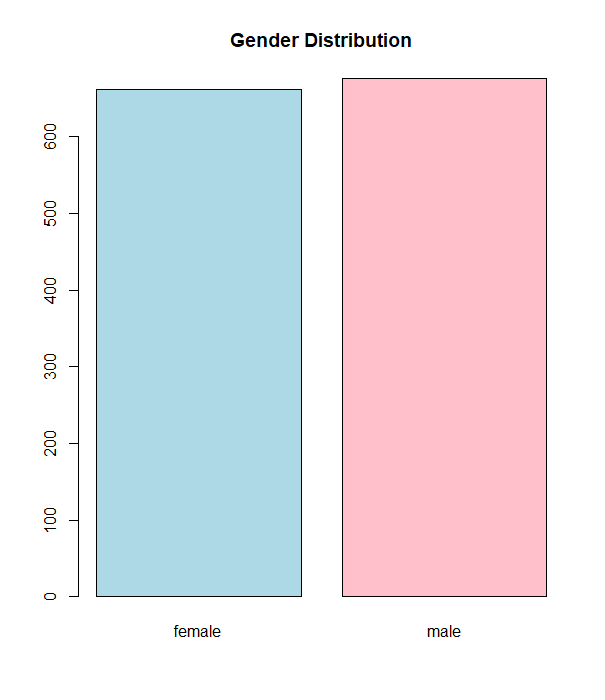
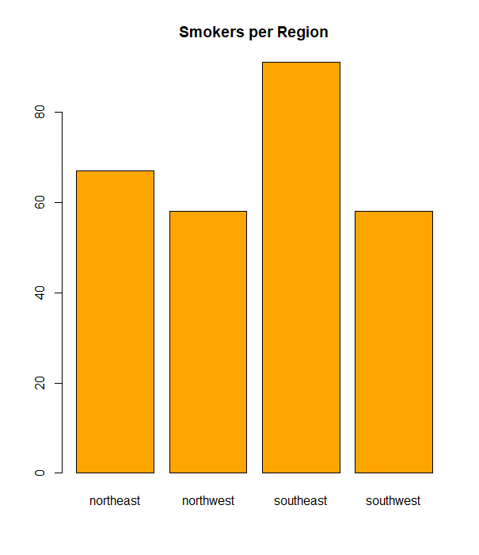
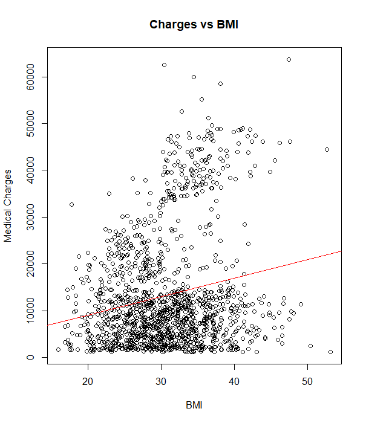
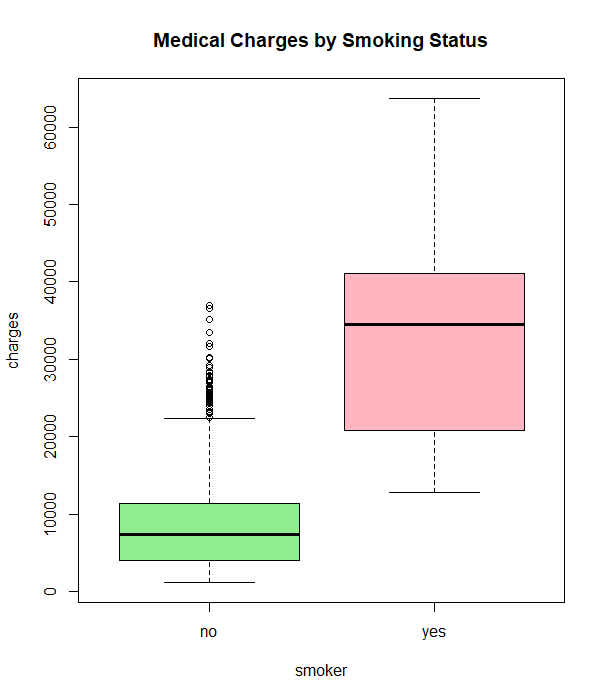

# Medical Insurance Charges Data Analysis

This project explores a medical insurance dataset containing demographic and health-related information such as age, sex, BMI, smoking status, number of children, region, and medical charges. The goal is to understand key factors influencing insurance charges and provide meaningful insights through statistical analysis.

---

### Question 1: Number of duplicate rows

**Result:** There was 1 duplicate row in the dataset.

**Interpretation:** The dataset is nearly unique, indicating good data quality with minimal repeated records. Removing or addressing duplicates ensures our analysis is not biased by repeated data points.

---

### Question 2: Gender count

**Result:** There are 662 females and 676 males in the dataset.

**Interpretation:** The dataset is fairly balanced in terms of gender, which allows us to compare charges and other variables between males and females without worrying about major class imbalance.

---

### Question 3: Smokers vs Non-smokers count

**Result:** 274 smokers and 1064 non-smokers.

**Interpretation:** The majority of the individuals do not smoke. This imbalance is important because smoking status strongly affects medical charges, as will be seen later.

---

### Question 4: Average charges for smokers vs non-smokers

**Result:**

* Average charges for smokers: \$32,050.23
* Average charges for non-smokers: \$8,434.27

**Interpretation:** Smokers pay on average almost 4 times more than non-smokers, which strongly suggests smoking is a key driver of higher medical costs.

---

### Question 5: Person who paid the most and the least

**Result:**

* Highest charge: \$63,770.43 (54-year-old female, smoker, BMI 47.41)
* Lowest charge: \$1,121.87 (18-year-old male, non-smoker, BMI 23.21)

**Interpretation:** The highest charge aligns with known risk factors — older age, female, very high BMI, and smoking. The lowest charge belongs to a young, healthy male non-smoker. This highlights how age, BMI, and smoking can drastically affect charges.

---

### Question 6: Number of adults and children

**Result:** 1,338 adults (age ≥ 18), 0 children (age < 18).

**Interpretation:** The dataset only includes adults, which should be considered when generalizing findings. Children’s medical costs are not represented here.

---

### Question 7: Average BMI by region

**Result:**

* Southwest: 30.60
* Southeast: 33.36
* Northwest: 29.20
* Northeast: 29.17

**Interpretation:** The Southeast region has the highest average BMI, which may correlate with higher medical charges in that region due to obesity-related health issues.

---

### Question 8: What is the gender distribution of the patients?

**Insight:** The dataset contains a similar amount of both male and female patients. Understanding the gender balance is important when interpreting differences in charges, BMI, or smoking habits.

---

### Question 9: Smokers per region bar plot

**Insight:** Visualizing smokers by region reveals if smoking prevalence varies geographically, which might explain regional differences in charges.

---

### Question 10: Average charges for male smokers vs female smokers

**Result:**

* Male smokers average: \$33,042.01
* Female smokers average: \$30,679.00

**Interpretation:** Male smokers tend to incur slightly higher charges than female smokers, potentially due to differences in smoking habits or related health outcomes.

---

### Question 11: Number of obese individuals (BMI ≥ 30)

**Result:** 707 individuals are classified as obese.

**Interpretation:** Over half of the dataset (approx. 53%) are obese, indicating obesity is a significant health factor in this population and likely impacts medical costs.

---

### Question 12: Best region to move to for lower medical charges

**Result:** The Southwest region has the lowest average charges: \$12,346.94.

**Interpretation:** Considering regional differences, Southwest might offer more affordable medical insurance costs, potentially due to lower BMI, fewer smokers, or other demographic factors.

---

### Question 13: Average charges for people with children vs without children

**Result:**

* With children: \$13,949.94
* Without children: \$12,365.98

**Interpretation:** Having children slightly increases average charges, possibly due to additional health needs or lifestyle factors associated with parenting.

---

### Question 14: Correlation matrix between age, BMI, children, and charges

**Result (rounded):**

|          | age  | bmi  | children | charges |
| -------- | ---- | ---- | -------- | ------- |
| age      | 1.00 | 0.11 | 0.04     | 0.30    |
| bmi      | 0.11 | 1.00 | 0.01     | 0.20    |
| children | 0.04 | 0.01 | 1.00     | 0.07    |
| charges  | 0.30 | 0.20 | 0.07     | 1.00    |

**Interpretation:**

* Age and charges have a moderate positive correlation (0.30), meaning older individuals tend to pay more.
* BMI also has a positive correlation (0.20) with charges, reinforcing its impact.
* Number of children has a weak correlation with charges (0.07), indicating a minor effect.

---

### Question 15: T-test for charges between smokers and non-smokers

**Result:**

* t = -32.75, p-value < 2.2e-16 (very significant)
* Mean charges: smokers \~\$32,050; non-smokers \~\$8,434

**Interpretation:** There is a statistically significant difference in average medical charges between smokers and non-smokers, confirming smoking status as a major factor.

---

### Question 16: Linear regression predicting charges from BMI, age, and smoker status

**Summary:**

* Intercept: -11,676.83
* BMI coefficient: 322.62
* Age coefficient: 259.55
* Smoker flag coefficient: 23,823.68
* Adjusted R²: 0.7469 (explains \~75% of variance)

**Interpretation:**

* Each unit increase in BMI adds about \$323 to charges.
* Each additional year of age adds about \$260.
* Being a smoker adds almost \$24,000 in charges, holding other factors constant.
* The model fits well and confirms the large impact of smoking, age, and BMI on charges.

---

### Question 17: Scatter plot of charges vs BMI with regression line

**Insight:** The plot shows an upward trend, visually confirming that higher BMI generally corresponds to higher medical charges.

---

### Question 18: Boxplot of charges by smoker status

**Insight:** The boxplot visualizes the significant difference in the distribution of charges between smokers and non-smokers, with smokers having much higher and more variable charges.

---

### Question 19: BMI categories and their counts

**Result:**

* Underweight: 21
* Normal: 226
* Overweight: 386
* Obese: 389
* Severely Obese: 225
* Morbidly Obese: 91

**Interpretation:** Most individuals fall into the overweight or obese categories, underscoring the prevalence of excess weight in this population.

---

### Question 20: Average charges by BMI category, smoker status, and sex

**Key patterns:**

* Charges increase with BMI category for both smokers and non-smokers.
* Smokers have significantly higher charges than non-smokers in every BMI category and sex.
* Male smokers tend to pay slightly more than female smokers.

---

### Question 21: Percent increase in average charges for smokers compared to non-smokers

**Result:** Smokers pay on average 280% more than non-smokers.

**Interpretation:** This dramatic increase underscores the financial impact of smoking on medical insurance costs.

---

### Question 22: Average charges by number of children

**Result:** Charges generally increase as the number of children increases from 0 to 3 but show a drop for 4 and 5 children.

**Interpretation:** There is a slight trend for higher charges with more children up to three, but variability at higher numbers may be due to smaller sample sizes or other confounding factors.

---

# Summary

This analysis reveals that **smoking status, age, and BMI** are the strongest predictors of medical insurance charges, with smokers paying substantially higher fees. Geographic differences and family size also influence costs but to a lesser extent. These insights could inform insurance pricing, personal health decisions, and regional healthcare policies.

---

If you want, I can also help you format this as a proper README.md or presentation text with nice markdown styling or sections. Would you like that?
